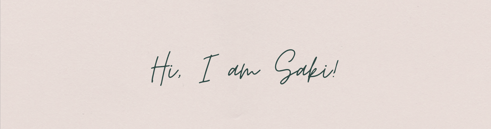

  

  
  <!---
  ### Hello, I'm Saki!  
  --->
  
  
  

  
  
- 👋 Hi, I’m @saki-imai-1204
- 🌱 I’m currently learning a PhD student at Northeastern University
- 📫 How to reach me imai.s@northeastern.edu

#### 📫 Connect with me:
  

&nbsp;&nbsp;
<a href="imai.s@northeastern.edu"> 

<h3 align="left">Languages and Tools:</h3>

                      

  

<!---
saki-imai-1204/saki-imai-1204 is a ✨ special ✨ repository because its `README.md` (this file) appears on your GitHub profile.
You can click the Preview link to take a look at your changes.
--->
